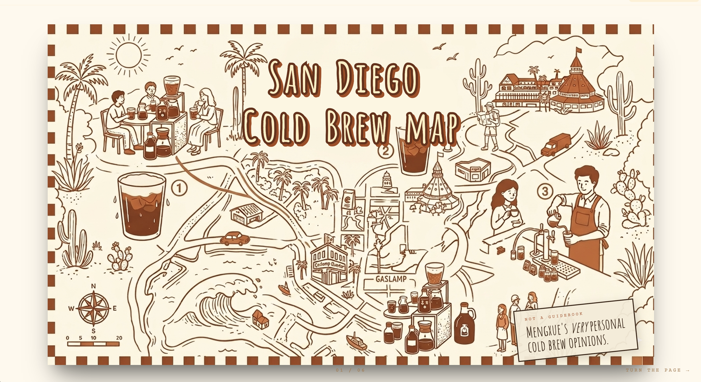

# Cold Brew Field Guide

A personal, editorial map of San Diego cold brew — styled like a vintage Japanese tourism pamphlet crossed with an indie zine.

Not a tech product. Not a delivery app. Just a friend who takes coffee very seriously made you a guide.




> 📸 Drop screenshots into `docs/screenshots/` with the filenames above to populate this section.

---

## Make Your Own

This project is open-source and built to be forked. Want to map the best ramen in Tokyo? The dive bars of New Orleans? The bookstores of Lisbon? Fork the repo, swap in your own data, deploy. **No accounts, no databases, no API keys.**

### Quick Start

```bash
# 1. Clone (or fork on GitHub first, then clone your fork)
git clone https://github.com/YOUR-USERNAME/cold-brew-map.git
cd cold-brew-map

# 2. Install
npm install

# 3. Run locally — admin mode auto-enables in dev
npm run dev
```

Open `http://localhost:5173/?admin=true` to edit. Edits write to `src/data/stores.json` and `public/photos/` — commit those files to publish.

### Deploy

Push to GitHub and import the repo in [Vercel](https://vercel.com/new). It's a static Vite build — no environment variables, no configuration. Done.

---

## How It Works

```
You (locally, admin mode)            Public visitors (deployed site)
─────────────────────────            ──────────────────────────────
npm run dev                          Read-only static site
?admin=true                          No admin code in bundle
Edit cards / upload photos           No backend, no database
↓                                    ↓
src/data/stores.json                 What you committed = what they see
public/photos/*.jpg
↓
git commit && git push
↓
Vercel auto-deploys
```

### Admin Mode is Dev-Only — On Purpose

`?admin=true` only works when you run `npm run dev` locally. The production build literally does not contain admin code (tree-shaken via `import.meta.env.DEV`). This means:

- ✅ No password to leak, no auth provider to configure
- ✅ Your deployed site has zero attack surface for editing
- ✅ Forkers get the same workflow with zero setup

The trade-off: you can't edit from a phone browser. You edit on your computer, commit, push.

---

## Project Structure

```
src/
├── components/
│   ├── Book/            # Magazine page-flip container
│   ├── CoverPage/       # Title spread
│   ├── CardVariants/    # Coffee card layouts
│   ├── AdminPanel/      # Edit modal (dev-only)
│   └── Demo/            # ?demo=true preview mode
├── data/
│   ├── stores.json      # ← Your content lives here
│   ├── stores.ts        # Loads from stores.json
│   ├── storage.ts       # localStorage + dev-server sync
│   ├── config.ts        # Site title, subtitle, etc.
│   └── types.ts         # Store interface
└── styles/
    └── globals.css
```

## Customizing

| Want to change…       | Edit                                  |
|-----------------------|---------------------------------------|
| Site title / subtitle | `src/data/config.ts`                  |
| Color palette         | `tailwind.config.ts`                  |
| Fonts                 | `index.html` + `tailwind.config.ts`   |
| Demo data             | `src/data/stores.json`                |
| Card layouts          | `src/components/CardVariants/`        |

The design system is documented in [`CLAUDE.md`](./CLAUDE.md).

---

## URL Modes

| URL                       | What it does                                  |
|---------------------------|-----------------------------------------------|
| `/`                       | Public read-only view                         |
| `/?demo=true`             | Layout/style preview gallery                  |
| `/?backdrop=cream`        | Switch backdrop (`dark` \| `desk` \| `cream`) |
| `/?admin=true` *(dev only)* | Edit mode — only works under `npm run dev` |

---

## Tech

Vite · React · TypeScript · Tailwind · Vercel

## License

MIT — see [LICENSE](./LICENSE). Fork it, remix it, make it yours.

## Credits

Original guide by [Mushroom](https://github.com/mengxuebi). Visual inspiration from the Hirosaki Apple Pie Guide Map and a deep love of paper zines.
